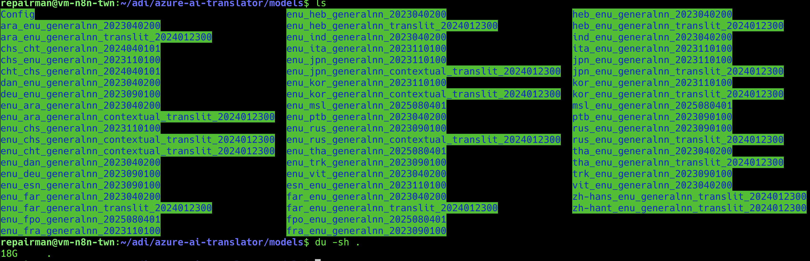
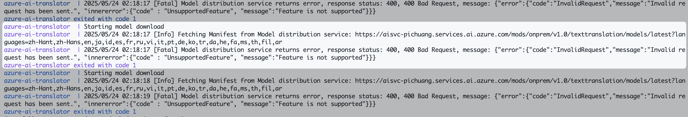
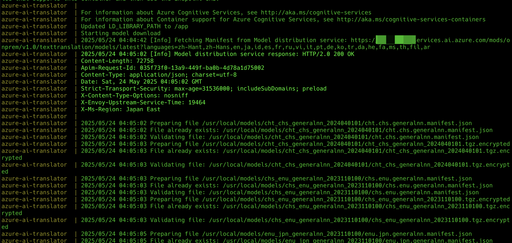

# Azure AI Container

## How to Use?

```bash
git clone https://github.com/pichuang/azure-ai-container
cd azure-ai-container
cp .env.example .env
cat .env
./1-prepare.sh
./2-run-prod.sh
./3-curl-test.sh
```

## How does it works?

請查閱 [docker-compose.yaml](docker-compose.yaml)

## Q&A

### 要如何保留 AI Translation 的語系檔?

  需要把容器內的 /usr/local/models 掛載出來到外部資料夾 (./azure-ai-translator/models) 保存

  ```yaml
      volumes:
          - ./azure-ai-translator/models:/usr/local/models
  ```

  

### 語系檔多大? 要準備多大的空間放置語系檔?

約略 18G, 會隨語系選擇增多而變大, 準備 50G 以上空間是適合的選擇

### 預設 AI Container 的 User / Group 為何?

uid=65532(nonroot) gid=65532(nonroot) groups=65532(nonroot)

### 要怎麼樣確保可以從容器內部寫入資料到外部資料夾?

確保權限內外皆有寫的權限

因容器內部 uid/gid 皆為 65532, 故掛載出去的資料夾也需要讓 65532 有權限可以讀寫, 為此外部資料夾需要透過以下方式建立

  ```bash
  #
  # azure-ai-translator
  #
  mkdir -p ./azure-ai-translator/models
  mkdir -p ./azure-ai-translator/logs
  # mkdir -p ./azure-ai-translator/license
  sudo chown -R 65532:65532 ./azure-ai-translator
  sudo chmod -R o+w ./azure-ai-translator
  ```

### 如果使用沒有經過申請的 Endpoint 會如何?

- Failed
  

- Success
  

### 如果不要讓它一直去下載語系檔的話, 應該要怎麼做

  環境變數 MODELS 和 TRANSLATORSYSTEMCONFIG 都需要給他參數

```yaml
- MODELS: "/usr/local/models/chs_cht_generalnn_2024040101,/usr/local/models/chs_enu_generalnn_2023110100,/usr/local/models/cht_chs_generalnn_2024040101,/usr/local/models/dan_enu_generalnn_2023040200,/usr/local/models/deu_enu_generalnn_2023090100,/usr/local/models/enu_chs_generalnn_2023110100,/usr/local/models/enu_chs_generalnn_contextual_translit_2024012300
- TRANSLATORSYSTEMCONFIG: /app/translator_system_config
```

TRANSLATORSYSTEMCONFIG 的多寡, 並不會影響 Microsoft.CloudAI.Containers.Translator 讀取的多寡

### 決定 Microsoft.CloudAI.Containers.Translator 會匯入多大多小的參數是哪一個?

  `MODELS` 放的路徑越多, 所需要的記憶體會越大, 且這程式有讀取上限

### 為何 azure-ai-read 沒有 healthcheck?

  因為容器沒有內建 curl
